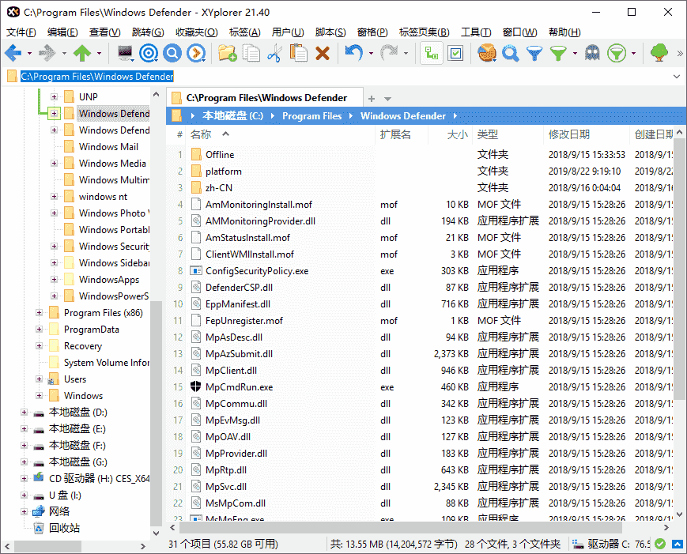
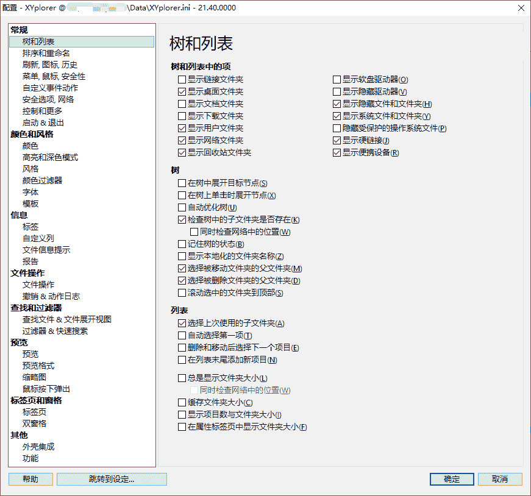

# XYplorer 28.30.2500 绿色版 - 资源管理器

XYplorer 是一款功能强大的 Windows 文件管理器，提供比传统资源管理器更为丰富的功能和定制选项。它集成了多标签浏览、强大的文件搜索、可编写脚本的自动化任务等功能，使文件操作更加高效和灵活。XYplorer 专为需要高效文件管理的用户设计，特别适合高级用户和 IT 专业人员。

官方网站：www.xyplorer.com

## 截屏

## 功能摘要

1. 多标签浏览
   - 支持多标签页面，用户可以像在网页浏览器中一样，方便地在多个文件夹之间切换，提高工作效率。
2. 强大的文件搜索
   - 提供高速且功能强大的文件搜索功能，支持按名称、日期、大小、内容等多种条件进行筛选，确保快速找到所需文件。
3. 文件预览
   - 内置多种格式的文件预览功能，支持图片、文本、视频、音频等多种文件类型的即时预览，方便快速查看文件内容。
4. 可编写脚本的自动化任务
   - 允许用户编写脚本来自动执行复杂的文件管理任务，适合需要批量处理文件的用户，大幅提升操作效率。
5. 强大的文件操作
   - 提供丰富的文件操作功能，如批量重命名、文件复制/移动、文件夹同步等，并支持撤销和重做，确保文件管理的灵活性和安全性。
6. 便携模式
   - 支持便携模式，无需安装即可运行，用户可以将 XYplorer 放在 USB 闪存驱动器中随时随地使用。
7. 高度可定制的界面
   - 允许用户根据个人喜好定制界面布局、颜色、字体等，创建最适合自己工作习惯的文件管理环境。
8. 文件标签与注释
   - 支持为文件和文件夹添加标签和注释，方便分类和快速检索，尤其适合需要管理大量文件的用户。
9. 文件夹树和列表视图
   - 提供直观的文件夹树和列表视图，用户可以轻松导航和管理文件结构，支持拖放操作和键盘快捷键。

## 更新日志

https://www.xyplorer.com/whatsnew.php#current

## 下载地址

[XYplorer 28.30.2500 绿色版](https://u.pcloud.link/publink/show?code=XZsx1HJZXNVnjgyDjx0A64QO7fvb9mv77EEk)
